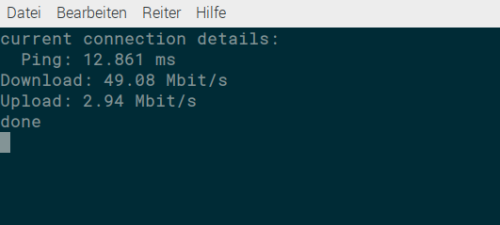

# dynDnsUpdater
script that monitors the network connection and updates the dynDns-ip on change

# NO RELEASE // JUST A SHOWCASE #

## Features:

### gui

### background or terminal mode

### custom interval IP check

### up/down speedtest +ping

### logs saved as html file

### pushes new ip to dynDns
